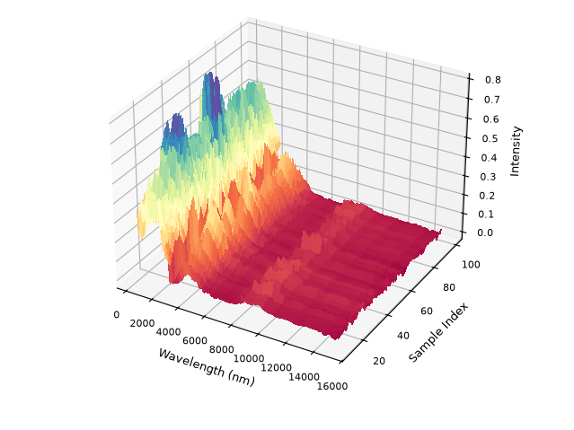

pytsg
=====

`pytsg` reads The Spectral Geologist (TSG) package format into a simple class, exposes the data as NumPy
arrays and pandas DataFrames. Use the :func:`pytsg.read_tsg` function to load the complete TSG package,
or choose one of the explicit direct readers for an individual component.

The Spectral Geologist (TSG) is an industry standard software for hyperspectral data analysis.
https://research.csiro.au/thespectralgeologist/

Thanks to CSIRO and in particular Dr Andrew Rodger for assistance in decoding the file structures.

.. toctree::
   :maxdepth: 2
   :caption: Getting Started
   :hidden:

   installation/installation
   quick-start/quick-start
   examples/index
   api/modules
   glossary/glossary
   related/related
   citation/citation

.. TEMP: intentional Sphinx warning to prove the pipeline Docs stage and
   Read the Docs fail on warnings. Remove the missing-page entry before merging.

.. toctree::
   :maxdepth: 2
   :caption: Development
   :hidden:

   contributing/contributing
   intentional-warning/missing-page

.. toctree::
   :maxdepth: 2
   :caption: Project Links
   :hidden:

   GitHub Repository <https://github.com/Geological-Survey-of-Western-Australia/pytsg>
   Issue Tracker <https://github.com/Geological-Survey-of-Western-Australia/pytsg/issues>
   PyPi Page <https://pypi.org/project/pytsg>